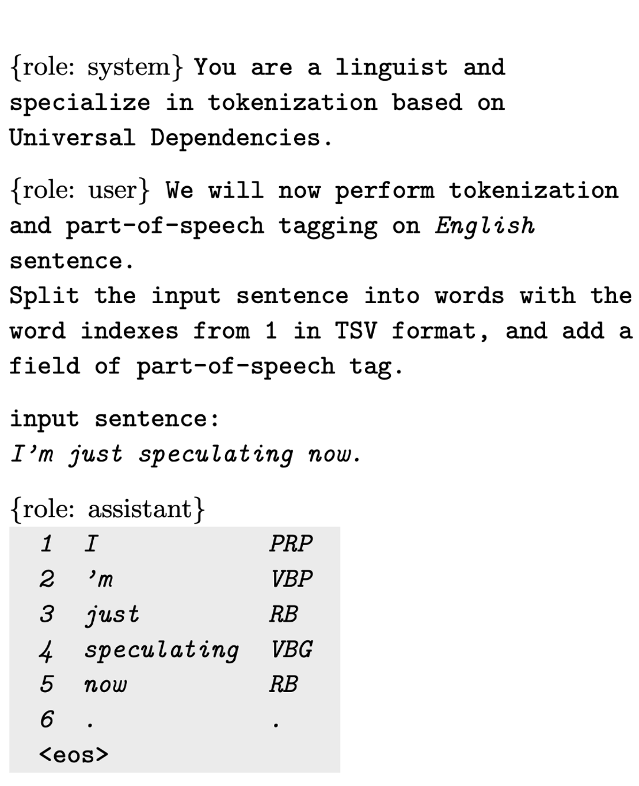
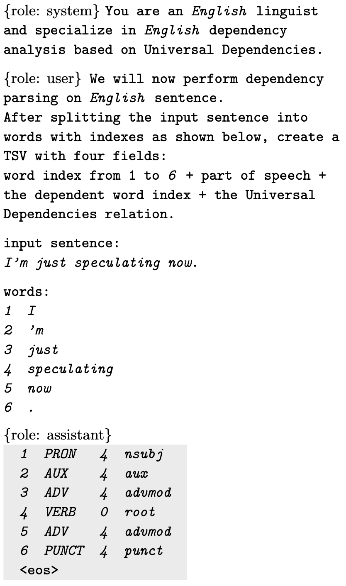

# omnes-flores: A Unified NLP Framework

[](https://pepy.tech/project/omnes-flores)

## Terms of Use

To use the base model [`google/gemma-2-9b`](https://huggingface.co/google/gemma-2-9b), you must agree to the terms of use in your HuggingFace account.

> To access Gemma on Hugging Face, you’re required to review and agree to Google’s usage license. To do this, please ensure you’re logged in to Hugging Face and click below. Requests are processed immediately.

The `omnes-flores` Python module is published under [Apache License Version 2.0](./LICENSE) and the dedicated models for `omnes-flores` are distributed under the license inherited from the Universal Dependencies treebanks used for training.

## Requirements

The initial `omnes-flores` release requires a Linux environment with NVIDIA GPUs (Ampere or later).
To run inference on the 9B parameter base model + LoRA using `bfloat16`, 24GB or more of GPU memory is required.
The following environments have been tested for operation.

- NVIDIA RTX Pro 6000 Blackwell 96GB
- CPU RAM 64GB
- Ubuntu 24.04
- CUDA 12.8
- Python 3.12
- vLLM 0.16.0
- Transformers 4.57.6

## Install

Installing the library is very simple like:

```Console
pip install omnes-flores
```

## Models

### `40-lang-41-treebank-v0` (CC BY-SA 4.0)

This model is available for commercial use.

```Console
omnes-flores < text_file > conllu_file
```

### `40-lang-42-treebank-v0` (CC BY-SA 4.0)

This model is available for commercial use.

```Console
omnes-flores --m megagonlabs/omnes-flores-40-lang-42-treebank-v0 < text_file > conllu_file
```

### `84-lang-99-treebank-non-commercial-v0` (CC BY-NC-SA 4.0)

This model is made available for non-commercial use, including academic use; commercial use is strictly prohibited.

```Console
omnes-flores --m megagonlabs/omnes-flores-84-lang-99-treebank-non-commercial-v0 < text_file > conllu_file
```

## Method

We use following prompts for three analysis components:






## [Version History](https://github.com/megagonlabs/omnes-flores/releases)

### 0.1.0-alpha
- 2026-03-09 Release 0.1.0a
